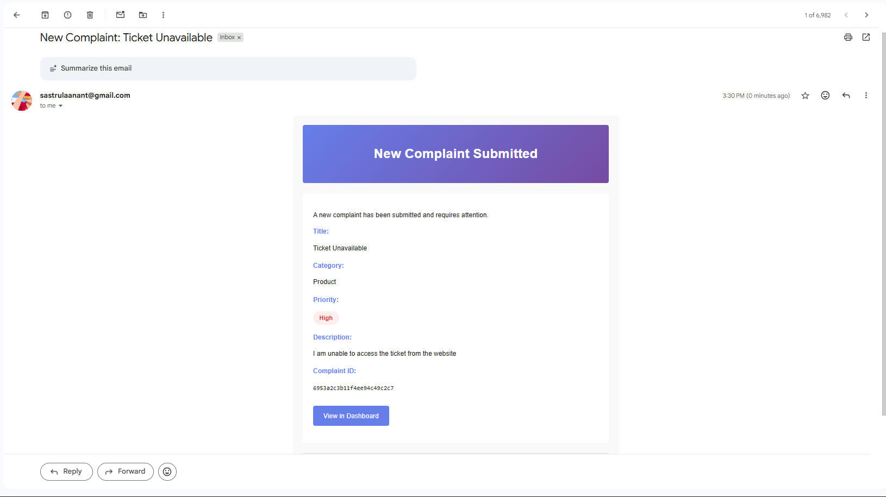
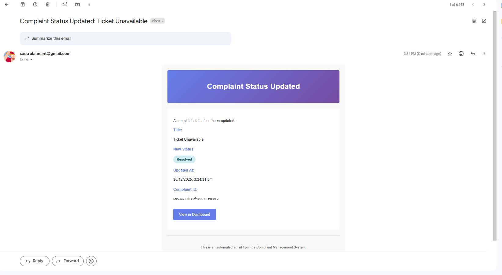

# Complaint Management System

A full-stack complaint management application built with Next.js 14 (App Router) and TypeScript. Users can submit complaints, and administrators can manage them through a secure, protected dashboard. The application uses MongoDB for persistent storage and Nodemailer for automated email notifications.

## Live Demo

[https://complaint-management-app-kappa.vercel.app/](https://complaint-management-app-kappa.vercel.app/)

---

## Admin Access

**Credentials:**

| Field | Value |
|-------|-------|
| Email | `admin@example.com` |
| Password | `admin_password` |

**Steps to access:**
1. Open the application
2. Click "Admin Login" on the home page or navigate to `/login`
3. Log in using the credentials above
4. You will be redirected to the admin dashboard at `/admin`

---


## Features

- User authentication via JWT (HTTP-only cookies)
- Complaint submission form with validation
- Admin dashboard with:
  - View all complaints with detailed information
  - Update complaint status (Pending, In Progress, Resolved)
  - Delete complaints
  - Filter by status and priority
  - Real-time statistics
- Automated email notifications for new complaints and status updates
- Role-based access control (user vs admin)
- Responsive design for mobile and desktop

---

## Tech Stack

| Component | Technology |
|-----------|-----------|
| Framework | Next.js 14 (App Router) |
| Language | TypeScript |
| Database | MongoDB (Mongoose) |
| Authentication | JWT with HTTP-only cookies |
| Email Service | Nodemailer (SMTP) |
| Styling | Tailwind CSS |
| Deployment | Vercel |

---

## Local Setup

### Prerequisites
- Node.js 18+ installed
- MongoDB Atlas account
- Gmail account with app password (for email)

### Installation Steps

1. **Clone the repository**
```bash
git clone https://github.com/Anant3008/Complaint-Management-App.git
cd Complaint-Management-App
```

2. **Install dependencies**
```bash
npm install
```

3. **Configure environment variables**

Create a `.env.local` file in the root directory:

```env
# Database
MONGODB_URI=mongodb+srv://<username>:<password>@cluster.mongodb.net/

# Security
JWT_SECRET=your_jwt_secret_key_here


# Admin Credentials
ADMIN_AUTH_EMAIL=admin@example.com
ADMIN_PASSWORD=admin_password

# Email Service (Gmail)
EMAIL_SERVICE=gmail
EMAIL_USER=your_email@gmail.com
EMAIL_PASSWORD=your_app_password
EMAIL_FROM=your_email@gmail.com
```

**Important Notes:**
- Replace MongoDB credentials with your actual connection string
- For Gmail, generate an App Password (not your login password)
- Never commit `.env.local` to version control

4. **Start the development server**
```bash
npm run dev
```

5. **Access the application**

Open your browser and navigate to: `http://localhost:3000`

---

## MongoDB Setup

1. Create a cluster on MongoDB Atlas
2. Create a database user with username and password
3. Whitelist your IP address (or use `0.0.0.0/0` for development)
4. Copy the connection string and add it to `.env.local` as `MONGODB_URI`

---

## Email Configuration

Email notifications are sent automatically via Nodemailer:

- **New Complaint**: Admin receives an email when a user submits a complaint
- **Status Update**: Admin receives an email when a complaint status changes

Emails include complaint details such as title, category, priority, and description.

---

## Project Structure

```
complaint-system/
├── app/
│   ├── page.tsx              # Home page (complaint submission)
│   ├── login/page.tsx        # Login page
│   ├── admin/page.tsx        # Admin dashboard
│   ├── api/
│   │   ├── auth/login/       # JWT authentication endpoint
│   │   └── complaints/       # Complaint CRUD endpoints
│   ├── components/           # Reusable React components
│   └── lib/
│       ├── auth.ts           # JWT utilities
│       ├── mongodb.ts        # Database connection
│       └── email/            # Email templates
├── middleware.ts             # Route protection middleware
├── .env.local               # Environment variables
└── package.json
```

---

## Screenshots

### Email Notifications

**New Complaint Submitted**

Automated email sent to admin when a user submits a new complaint with:
- Complaint title, category, and priority
- Full description of the issue
- Unique complaint ID
- Direct link to view in admin dashboard



**Complaint Status Updated**

Automated email sent to admin when complaint status is changed with:
- Complaint title
- New status (Pending, In Progress, or Resolved)
- Timestamp of the update
- Complaint ID for tracking



---

## Usage

**JWT Authentication**: Tokens are stored in HTTP-only cookies and validated via middleware for each protected route.

**Role-Based Access**: Only authenticated admins can access `/admin`. Users cannot access the admin dashboard.

**Email Notifications**: Automatic emails are sent to the admin's configured email address using SMTP.

**Data Persistence**: All complaints are stored in MongoDB with timestamps and status tracking.

---

## Notes

- This is a single Next.js deployment (no separate backend server)
- All API routes are handled as Next.js Route Handlers
- Route protection is implemented using Next.js middleware
- Authentication uses industry-standard JWT tokens in HTTP-only cookies
- The application is production-ready and can be deployed to Vercel
